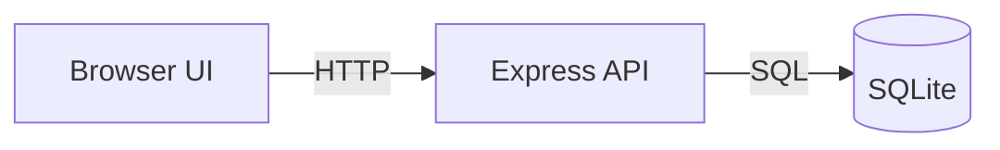

# Mermaid

## Scope

Use these rules when creating Mermaid diagrams for system views, flows, or architecture documentation.

## Rules

- Keep diagrams readable: avoid too many nodes, crossing lines, and redundant detail.
- Match the diagram type to the purpose: flowchart for logic, sequenceDiagram for request timing, and graph relationships for topology.
- Use labels that are short and meaningful; do not overload the diagram with implementation detail.
- Show the real runtime boundaries: browser, server, database, and external dependencies.
- Keep direction consistent and easy to follow.
- Prefer a small number of clearly named components over a crowded map of every implementation detail.
- Include only the components required to understand the flow or architecture.

## Example

## Validation

- [ ] The diagram matches the actual architecture or flow.
- [ ] Labels are readable and not overloaded.
- [ ] The visual focus is on the essential system boundary or interaction.
- [ ] The diagram is maintainable and easy for developers to scan.
