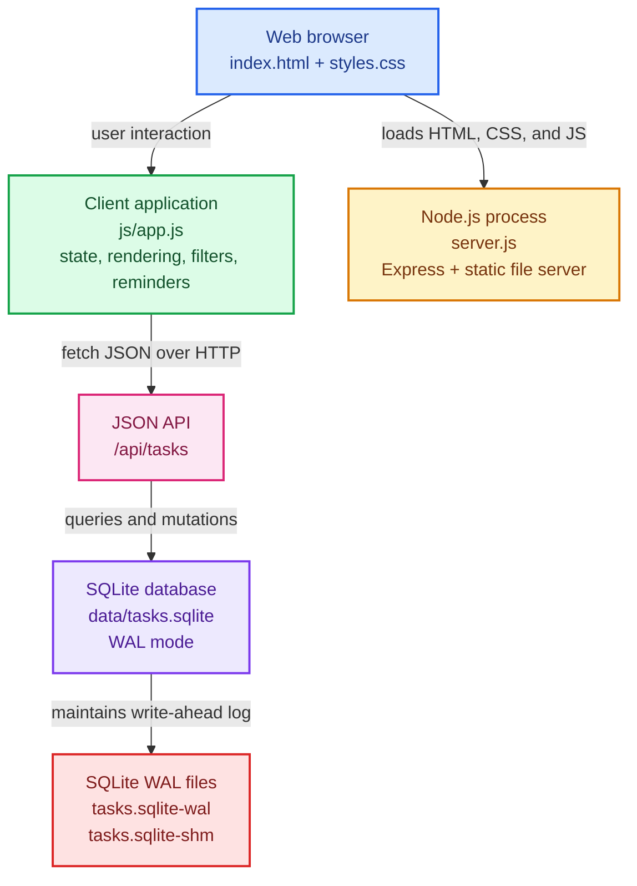
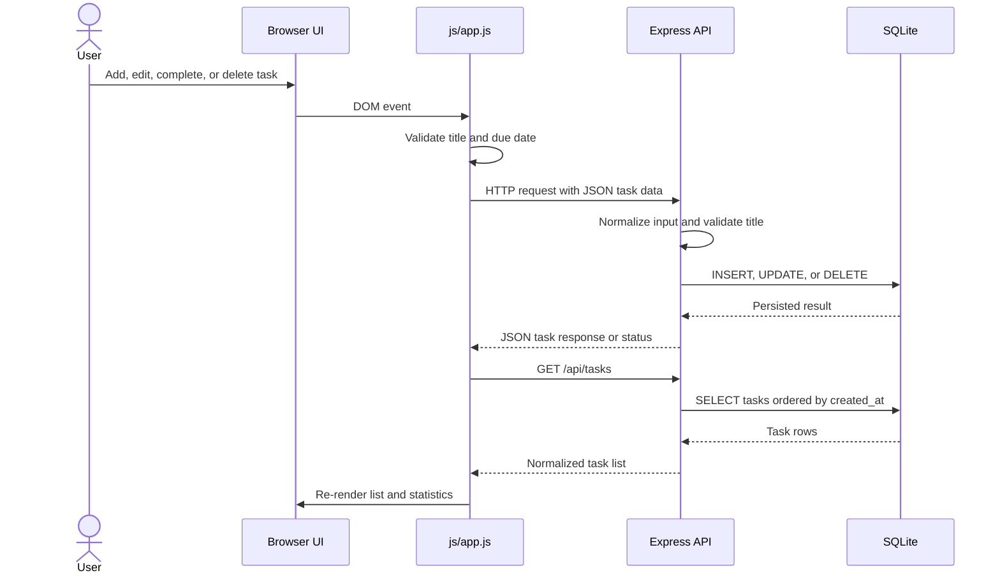
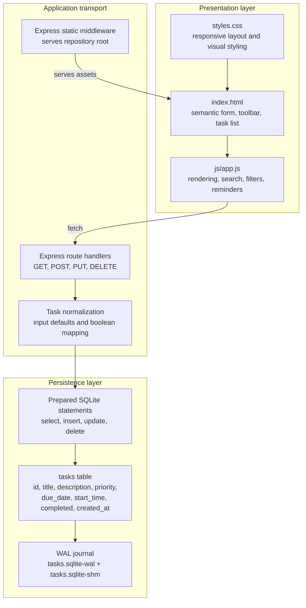
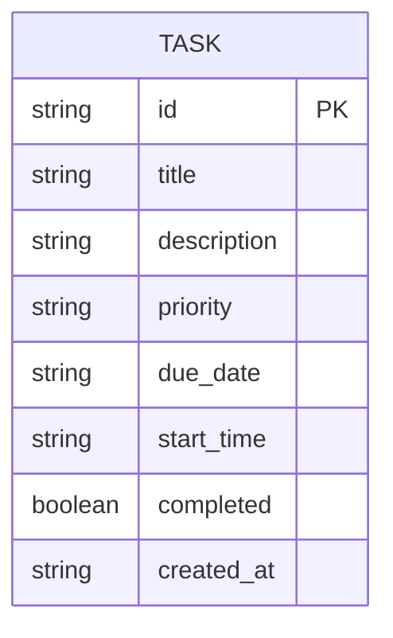

# Todo List Manager Architecture

This document describes the local runtime architecture of Todo List Manager. The application is a browser client served by Express, with a JSON API and a file-backed SQLite database in the same Node.js process. There is no separate frontend build, database server, authentication service, or external API dependency in the repository.

## Runtime topology

## Request and persistence flow

## Application layers and responsibilities

## Task data model

## Key relationships

- The browser loads the static application from the same Express process that owns the API.
- `js/app.js` keeps the current task list in memory for filtering, searching, rendering, statistics, and reminder checks.
- Mutating operations refresh the in-memory list with `GET /api/tasks` after the server responds.
- The server normalizes SQLite integer completion values into JSON booleans before returning task data.
- SQLite WAL mode provides the database journal files shown in the runtime topology; these files are operational database state, not additional application services.
- Upcoming-task reminders are entirely client-side. They run on a one-minute interval and do not create a server-side scheduled job.

## Operational boundary

Run `npm start` to start the Node.js process. The default listener is `http://localhost:3000`; setting `PORT` changes the listener port. The database directory is created automatically beside the application files, and the schema is created on startup when it does not already exist.
