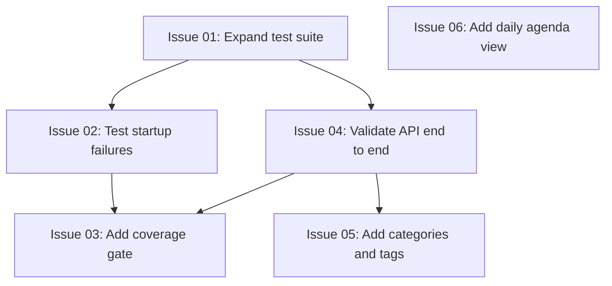

# Issues

This folder contains one issue file per testing gap identified during the review of the current implementation against the repository testing rules.

- [issue-01-test-suite-too-narrow.md](issue-01-test-suite-too-narrow.md)
- [issue-02-no-startup-failure-path-tests.md](issue-02-no-startup-failure-path-tests.md)
- [issue-03-no-coverage-gate.md](issue-03-no-coverage-gate.md)
- [issue-04-no-end-to-end-api-validation.md](issue-04-no-end-to-end-api-validation.md)
- [issue-05-categories-tags.md](issue-05-categories-tags.md)
- [issue-06-daily-agenda-view.md](issue-06-daily-agenda-view.md)

## Proposed Dependency Order

The arrows show a recommended delivery dependency, not a strict blocker for starting parallel work.

### Dependency Notes

- Issue 01 establishes broader runtime test coverage before specialized test work.
- Issues 02 and 04 can proceed in parallel after Issue 01 and provide the baseline for Issue 03.
- Issue 03 should follow Issues 02 and 04 so the coverage threshold measures meaningful behavior.
- Issue 05 benefits from Issue 04 because its new API contract needs integration coverage.
- Issue 06 is independent of the testing and tagging tracks and can be delivered in parallel.
